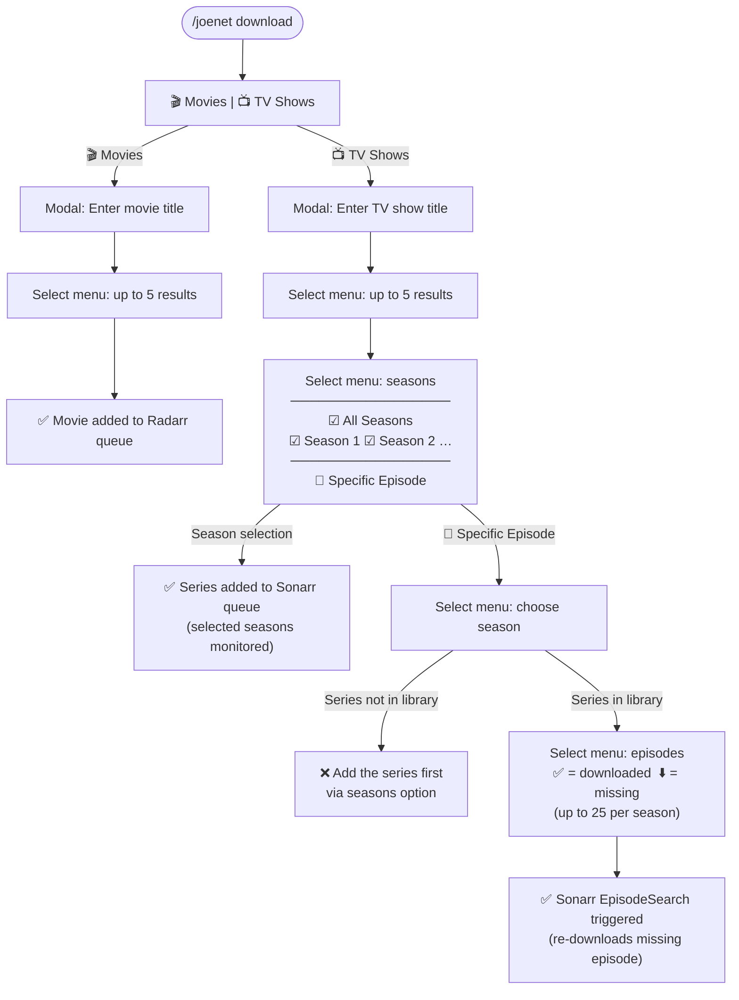

# Fitz-Bot

A Discord bot built with Java and Spring Boot that tracks voice channel joins and sends milestone congratulations. The bot features automatic channel cleanup, configurable per-server settings, and persistent data tracking with "as of" date functionality.

## Features

- 🎤 **Voice Join Tracking** - Tracks when users join voice channels (not moves between channels)
- 📅 **As Of Date Tracking** - Automatically records when tracking started for each server for accurate milestone context
- 🏆 **Milestone Celebrations** - Sends congratulatory messages at configurable milestones (default: 1, 5, 10, 25, 50, 100, 250, 500, 1000 joins)
- 💾 **Persistent Data Storage** - Voice join counts and tracking dates persist between bot restarts
- 🗑️ **Smart Channel Cleanup** - Automatically deletes empty temporary voice channels
- 🏠 **Multi-Server Support** - Each Discord server has its own isolated configuration and data
- ⚙️ **Configurable Bot Channels** - Set which channel receives milestone notifications per server
- 🔧 **REST API Management** - Full bot control via HTTP endpoints
- 📊 **Reliable Statistics** - Robust data persistence with JSON serialization and MongoDB-ready schema
- 🎬 **Media Download Integration** - Search and download movies via Radarr integration
- 📺 **TV Show Downloads** - Search and download TV shows via Sonarr with flexible season selection or individual episode targeting
- ⛏️ **Minecraft Whitelist** - Role-gated `/whitelist` command adds players to the Minecraft server over RCON

## Tech Stack

- **Java 17+** with Spring Boot 3.2.6
- **JDA 5.0.0-beta.21** (Java Discord API)
- **Jackson** with JavaTimeModule for JSON processing and LocalDateTime serialization
- **Lombok** for clean POJOs
- **Gradle** for build management

## Prerequisites

- Java 17 or higher
- Discord Bot Token
- Gradle (included via wrapper)

## Setup

### 1. Clone the Repository
```bash
git clone <repository-url>
cd Fitz-Bot
```

### 2. Configure Discord Bot Token
Create or edit `src/main/resources/application.properties`:
```properties
discord.bot.token=YOUR_DISCORD_BOT_TOKEN_HERE
server.port=8080
```

### 3. Create Discord Application
1. Go to [Discord Developer Portal](https://discord.com/developers/applications)
2. Create a new application
3. Go to "Bot" section and create a bot
4. Copy the bot token to your `application.properties`
5. Under "OAuth2 > URL Generator":
   - Select "bot" and "applications.commands" scopes
   - Select "Send Messages", "Use Slash Commands", "Read Message History", "View Channels" permissions
   - Use the generated URL to invite the bot to your server

### 4. Build and Run
```bash
# Build the project
./gradlew clean build

# Run the application
./gradlew bootRun
```

The bot will start automatically when the application launches and register slash commands immediately.

## Usage

### Slash Commands

#### `/setbotchannel #channel`
Set the channel where milestone messages will be sent.
- **Permission Required**: Manage Server
- **Example**: `/setbotchannel #bot-announcements`

#### `/getbotchannel`
Shows the currently configured bot channel for your server.

#### `/joenet download`
Search and download movies or TV shows from your Radarr/Sonarr instance.
- Select between Movies or TV Shows
- Search by title
- Select from up to 5 results
- For TV shows: Choose specific seasons, all seasons, or **a single episode**
- **Example**: `/joenet download` → Select "Movies" → Enter "Wicked" → Select result

##### UI Flow



#### `/joenet status`
View the current Radarr and Sonarr download queues, including progress percentages and ETAs.

#### `/whitelist <username>`
Adds a player to the Minecraft server whitelist over RCON.
- **Access**: gated to members holding the role configured via `/setwhitelistrole` (administrators are always allowed). If no role is set, only admins can use it.
- **Validation**: the username must match Minecraft's rules (`3-16` characters, letters/digits/underscores) — this also prevents RCON command injection.
- The server's response (e.g. *"Added Steve to the whitelist"*) is shown back ephemerally.
- **Example**: `/whitelist Steve`

> Crawlers/bots are kept out by the Minecraft server itself: set `white-list=true` and `online-mode=true` in `server.properties`. This command only manages who is allowed in.

#### `/setwhitelistrole <role>`
Sets which Discord role may use `/whitelist`. Requires the **Manage Server** permission.
- **Example**: `/setwhitelistrole @Trusted`

### REST API Endpoints

The bot provides HTTP endpoints for management:

```http
# Get bot status
GET http://localhost:8080/bot/status

# Manually start the bot
POST http://localhost:8080/bot/startup

# Stop the bot
POST http://localhost:8080/bot/shutdown

# Force update commands for all servers
POST http://localhost:8080/bot/force-update-commands

# Register commands for a specific server (instant)
POST http://localhost:8080/bot/register-guild-commands/{guildId}
```

## Configuration

### Per-Server Settings
Each Discord server can configure:
- **Bot Channel**: Where milestone messages are sent
- **Custom Milestones**: Override default milestone thresholds (future feature)

### JoeNet Media Download Configuration
Configure Radarr and Sonarr integration in `application.properties`:

```properties
# JoeNet Host Configuration
joenet.host=${JOENET_HOST:your-host-here}

# Radarr Configuration (Movies)
joenet.radarr.port=7878
joenet.radarr.apikey=${JOENET_RADARR_APIKEY:your-api-key-here}
joenet.radarr.quality-profile-id=${JOENET_RADARR_QUALITY_PROFILE_ID:4}
joenet.radarr.root-folder-path=${JOENET_RADARR_ROOT_FOLDER_PATH:P:\\\\Plex\\\\Movies}

# Sonarr Configuration (TV Shows)
joenet.sonarr.port=8989
joenet.sonarr.apikey=${JOENET_SONARR_APIKEY:your-api-key-here}
joenet.sonarr.quality-profile-id=${JOENET_SONARR_QUALITY_PROFILE_ID:4}
joenet.sonarr.root-folder-path=${JOENET_SONARR_ROOT_FOLDER_PATH:P:\\\\Plex\\\\TV}
```

**Features:**
- **Movie Downloads**: Search movies via Radarr API by title (TMDB lookup)
- **TV Show Downloads**: Search series via Sonarr API by title (TVDB lookup)
- **Flexible Season Selection**: Download all seasons, specific seasons, or multiple seasons
- **Individual Episode Download**: Pick a single episode from any season already in your Sonarr library — useful for re-triggering missed downloads
- **Interactive Discord UI**: Button-driven interface with dropdown menus
- **Error Handling**: Graceful handling of duplicate media and connection errors

### Minecraft RCON Configuration
The `/whitelist` command talks to the Minecraft server over RCON. Configure the endpoint in `application.properties`:

```properties
# Minecraft RCON (must match server.properties on the MC server)
minecraft.rcon.host=${MINECRAFT_RCON_HOST:your-mc-host-here}
minecraft.rcon.port=${MINECRAFT_RCON_PORT:25575}
minecraft.rcon.password=${MINECRAFT_RCON_PASSWORD:changeme}
```

On the Minecraft server, enable RCON and lock the server down in `server.properties`, then restart it:

```properties
white-list=true
enforce-whitelist=true
online-mode=true
enable-rcon=true
rcon.port=25575
rcon.password=<strong-secret>
```

- `white-list` + `online-mode` keep anonymous/cracked crawler clients out.
- `enable-rcon` + `rcon.password` let Fitz-Bot manage the whitelist remotely.

### As Of Date Tracking
The bot automatically tracks when voice channel monitoring begins for each server:
- **Automatic Initialization**: Tracking date is set when the first user joins a voice channel
- **Persistent Storage**: Dates survive bot restarts and are stored in JSON format
- **Per-Server Tracking**: Each Discord server has its own independent tracking start date
- **Milestone Context**: Provides accurate "since [date]" context for milestone celebrations

### Data Storage & Persistence
- **Voice Join Counts**: Persistently stored in `data/guild_configs.json` with automatic backup
- **Server Configurations**: Saved with robust JSON serialization using Jackson + JavaTimeModule
- **Tracking Dates**: Stored as ISO 8601 LocalDateTime strings for precision and readability
- **Data Integrity**: Comprehensive test coverage ensures reliable persistence across restarts

#### JSON Schema Structure
```json
{
  "123456789": {
    "botChannelId": "987654321",
    "milestones": null,
    "trackingStartDate": "2025-08-02T22:42:48.1057174",
    "userJoinCounts": {
      "111111111": 25,
      "222222222": 10
    }
  }
}
```

#### MongoDB Migration Ready
For production deployments, a MongoDB-optimized schema is available at `schemas/mongodb-guild-config-schema.json`:
- Document-based structure with proper indexing
- Metadata tracking (createdAt, updatedAt, version)
- Schema validation and type safety
- Scalable design for enterprise use

### Channel Deletion Rules
The bot automatically deletes empty voice channels that match these patterns:
- Names starting with `temp-` or `room-`
- Names containing `private`
- Names containing numbers (user-created rooms)

## Data Management

### Tracking Lifecycle
1. **First User Joins**: Bot automatically initializes tracking date for the server
2. **Subsequent Joins**: Increments user count and checks for milestone achievements
3. **Milestone Reached**: Sends congratulatory message with "since [tracking date]" context
4. **Data Persistence**: Automatically saves all changes to disk

### Data Migration & Backup
- **Automatic Serialization**: All data automatically saved on changes
- **Cross-Platform Compatibility**: JSON format works across different operating systems
- **MongoDB Ready**: Easy migration path to MongoDB for larger deployments
- **Version Control**: Schema versioning support for future data migrations

## Development

### Running Tests
```bash
./gradlew test
```

### Code Style
- Uses Lombok for reducing boilerplate
- Comprehensive JavaDoc documentation
- Slf4j for logging
- Builder pattern for complex objects

## Troubleshooting

### Slash Commands Not Appearing
1. Use the force update endpoint: `POST /bot/force-update-commands`
2. Or register for specific server: `POST /bot/register-guild-commands/{guildId}`
3. Global commands can take up to 1 hour to appear

### "Application did not respond" Error
- Check application logs for detailed error messages
- Ensure bot has proper permissions in your Discord server
- Verify the bot token is correct in `application.properties`

### Bot Not Starting Automatically
- Check that `discord.bot.token` is set in `application.properties`
- Review startup logs for connection issues
- Ensure Discord bot token has not expired

## Contributing

1. Fork the repository
2. Create a feature branch (`git checkout -b feature/amazing-feature`)
3. Make your changes
4. Add tests if applicable
5. Commit your changes (`git commit -m 'Add amazing feature'`)
6. Push to the branch (`git push origin feature/amazing-feature`)
7. Open a Pull Request

## Support

If you encounter any issues or have questions:
1. Check the troubleshooting section above
2. Review the application logs
3. Open an issue on GitHub with detailed information about your problem

---

Built by [@Mattlol85](https://github.com/Mattlol85)
